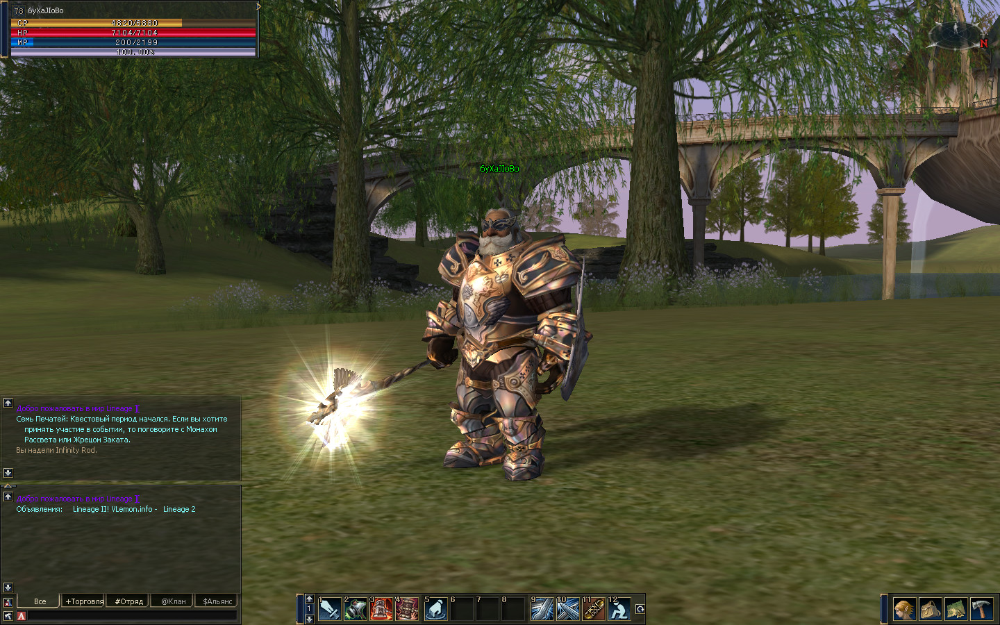
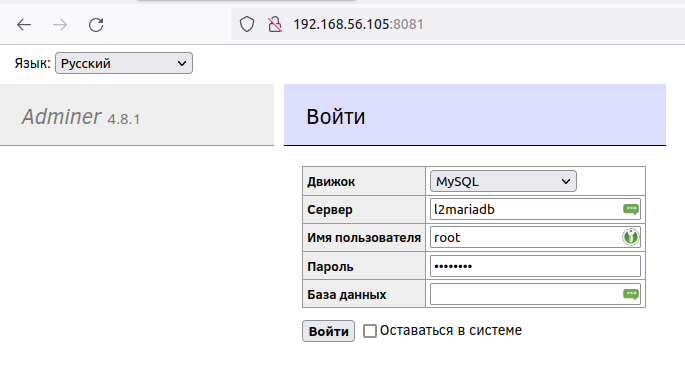
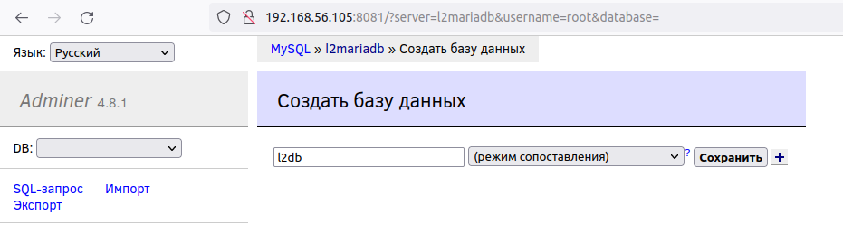
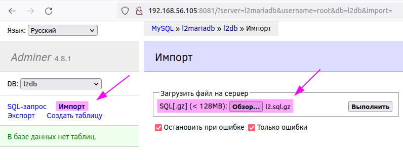
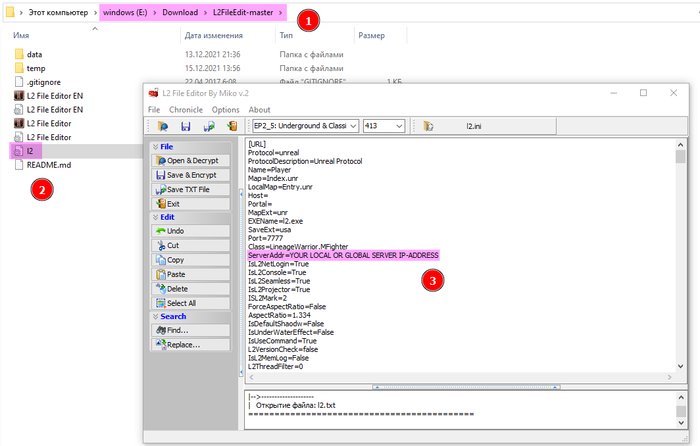

# Сервер Lineage II Chronicle 4: Scions of Destiny (x86-64)



* [Описание сборки](#описание-сборки)
  * [Содержание сборки](#содержание-сборки)
  * [Локальная версия сборки](#локальная-версия-сборки)
  * [Настройки](#настройки)
* [Запуск игрового сервера](#запуск-игрового-сервера)
* [Подключение к серверу](#подключение-к-серверу)
* [Источник](#источник)

## Описание сборки

При запуске `docker-compose.yml` подымаются 4 контейнера:

 - `l2login` - сервер авторизации учетных записей игроков
 - `l2game` - игровой сервер
 - `l2mariadb` - система управления базами данных
 - `l2adminer` - менеджер баз данных

### Содержание сборки

 - [`Dockerfile.game`](Dockerfile.game) - сборка контейнера **l2game**
 - [`Dockerfile.login`](Dockerfile.login) - сборка контейнера **l2login**
 - [`l2.sql.gz`](l2.sql.gz) - чистый бэкап базы данных для сервера
 - [`config/game`](config/game) - содержит конфигурационные файлы для контейнера **l2game**
 - [`config/login`](config/login) - содержит конфигурационные файлы для контейнера **l2login**

### Локальная версия сборки

Для использования локальной версии сборки использовать подготовленный [архив](https://ftp.zhirov.website/program/Games/Lineage_2/server/Docker/x86-64.tar.gz).

### Настройки

В конфигурационных файлах

```
config/game/network/database.properties
config/login/network/database.properties
```

по умолчанию указана база данных с именем `l2db` (которую нужно будет создать после запуска стека). Подключение происходит по имени контейнера `l2mariadb` в общей сети (для всех контейнеров) `l2_net`. \
Пользователь для подключения к базе данных по умолчанию `root`, пароль (по умолчанию - `password`) необходимо сменить на свой, сделать это во всех трёх файлах:

```
config/game/network/database.properties
config/login/network/database.properties
docker-compose.yml
```

В файле

```
config/game/network/game.properties
```

`LoginHost` ссылается на контейнер `l2login` вместо IP-адреса. \
`ExternalHostname` для публичного (белого) IP-адреса, выданного провайдером - для игры через интернет. \
`InternalHostname` для IP-адреса ПК/сервера в локальной сети, на котором поднят стек серверов - для игры по локальной сети.

Остальные настройки по усмотрению.

## Запуск игрового сервера

1. `git clone https://git.zhirov.website/alexander/lineage-2-server.git`
2. Сконфигурировать файлы в `config` и/или `docker-compose.yml`
2. `docker-compose build .`
3. `docker-compose up -d`
4. Открыть в браузере `IP-адрес:8081`, по умолчанию `127.0.0.1:8081`. Первый запуск контейнера `l2mariadb` будет долгим, нужно подождать перед авторизацией



5. Авторизоваться на сервере `l2mariadb` с учетными данными (возможно измененными) `root:password`
6. Создать базу данных `l2db`



7. Загрузить бэкап с файла `l2.sql.gz`



8. Перезапустить стек серверов `docker-compose restart`

## Подключение к серверу

Для подключения к серверу необходимо иметь правильно-сконфигурированный файл `l2.ini`, который находится в игровой директории `system`. Для редактирования данного файла использовать утилиту [L2 File Editor](https://github.com/L2Miko/L2FileEdit) ([другой источник](https://ftp.zhirov.website/program/Games/Lineage_2/L2FileEdit-master.zip)). **ВАЖНО!** Для редактирования файла необходимо, чтобы в путях использования самой программы и файла отсутствовали символы кириллицы, иначе программа будет выдавать ошибку декодирования.



 1. Путь без символов кириллицы (возможно и без использования символов отступа)
 2. Файл `l2.ini` из игровой директори `system`
 3. Указать глобальный или локальный IP-адрес игрового сервера

## Источник

Данная Docker-сборка основана на сборке сервера с сайта [vlemon.info](https://www.vlemon.info/article/934-sozdanie-servera-lineage-2-scions-of-destiny-c4.html). Приветствуется апгрейд/улучшение данной Docker-сборки.